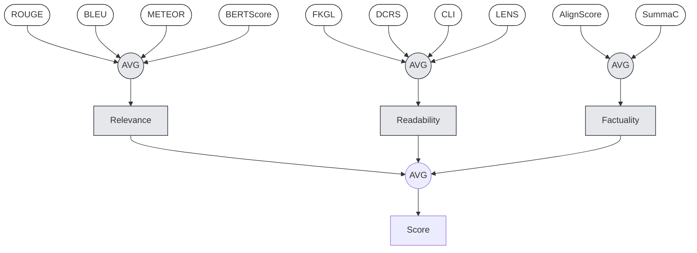
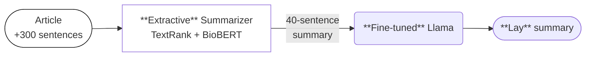
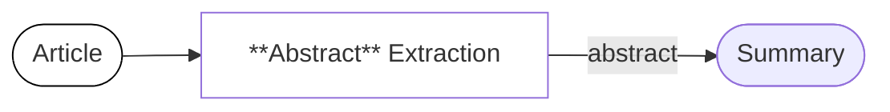
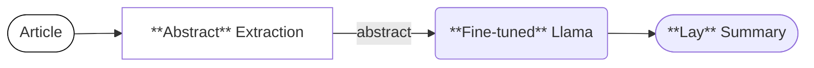
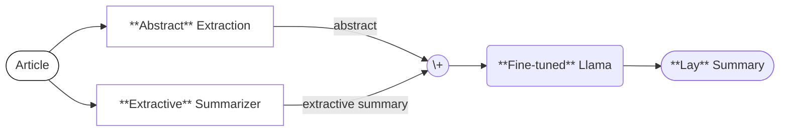
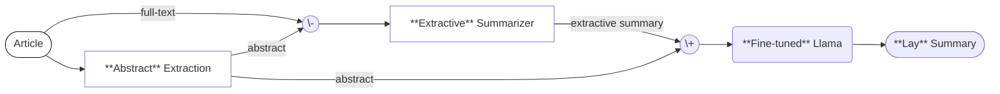
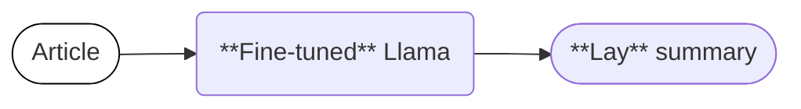

# Instruction-based Summarization with Contrastive Decoding

`SUWMIT` Priyam Basu, Jose Cols, Daniel Jarvis, Yongsin Park, Daniel Rodabaugh

---
layout: top-title
color: violet
---

:: title ::

# Introduction: `BioLaySumm 2025`

:: content ::

**Subtask 1.1** - Plain lay summarization.

  - Biomedical publications contain the **latest** research on **health**-related topics.
  - **Technical language** makes it **difficult** for non-expert audiences to understand their contents.

<v-switch>
  <template #1>

> **Article:** In temperate climates , winter deaths exceed summer ones . However , there is limited information on the timing and the relative magnitudes of maximum and minimum mortality , by local climate , age group , sex and medical cause of death . We used geo-coded mortality data and wavelets to analyse the seasonality of mortality by age group and sex from 1980 to 2016 in the USA and its subnational climatic regions .

<solar-arrow-down-bold-duotone class="text-4xl" />

> **Summary:** In the USA , more deaths happen in the winter than the summer . But when deaths occur varies greatly by sex , age , cause of death , and possibly region . Seasonal differences in death rates can change over time due to changes in factors that cause disease or affect treatment . Analyzing the seasonality of deaths can help scientists determine whether interventions to minimize deaths during a certain time of year are needed , or whether existing ones are effective .

  </template>
  <template #2> 

> In temperate climates , winter deaths exceed summer ones . However , there is limited information on the timing and the relative magnitudes of maximum and minimum mortality , by local climate , age group , sex and medical cause of death . We used geo-coded mortality data and wavelets to analyse the seasonality of mortality by age group and sex from 1980 to 2016 in the USA and its subnational climatic regions .

<solar-arrow-down-bold-duotone class="text-4xl" />

> In the USA , more deaths happen in the winter than the summer . But when deaths occur varies greatly by sex , age , cause of death , and possibly region . Seasonal differences in death rates can change over time due to changes in factors that cause disease or affect treatment . Analyzing the seasonality of deaths can help scientists determine whether interventions to minimize deaths during a certain time of year are needed , or whether existing ones are effective .

  </template>
  <template #3> 

> In temperate climates , winter deaths exceed summer ones . However , there is limited information on the timing and the relative magnitudes of maximum and minimum mortality , by local climate , age group , sex and medical cause of death . We used geo-coded mortality data and wavelets to analyse the seasonality of mortality by age group and sex from 1980 to 2016 in the USA and its subnational climatic regions .

<solar-arrow-down-bold-duotone class="text-4xl" />

> In the USA , more deaths happen in the winter than the summer . But when deaths occur varies greatly by sex , age , cause of death , and possibly region . Seasonal differences in death rates can change over time due to changes in factors that cause disease or affect treatment . Analyzing the seasonality of deaths can help scientists determine whether interventions to minimize deaths during a certain time of year are needed , or whether existing ones are effective . Now , Parks et al . show that there are age and sex differences in which times of year most deaths occur .

  </template>
</v-switch>

---
layout: top-title
color: violet
---

:: title ::

# Introduction: `Data`

:: content ::

- **2 datasets** (`PLOS` and `eLife`) with three splits: `train`, `validation`, and `test`.
- 30,735 biomedical articles with **expert-written** summaries *(English)*. 
- 284 articles (142 per dataset) include only the original text, with **no summaries**.

<v-click>

—

**Observations:**

1. *Readability* and *summary length* **vary** within each dataset.
2. These variations are **significant** when comparing the two datasets.

</v-click>

---
layout: full
---

Distribution of **summary lengths** across training and validation splits for the `PLOS` and `eLife` datasets

---
layout: top-title
color: violet
---

:: title ::

# Related Work

:: content ::

**Turbitt et al., 2023**

- Winners of BioLaySumm 2023.
- Few-shot prompting using the `text-davinci-003` model from OpenAI.
- A fine-tuned BioGPT model, 1/100th the size of `text-davinci-003`, showed comparable performance.

<v-click>

**You et al., 2024**

- Winners of BioLaySumm 2024.
- Extract-then-Summarize method with a fine-tuned GPT-3.5 model.
- They found that including external knowledge was detrimental for `factuality`.  

</v-click>

---
layout: top-title
color: violet
---

:: title ::

# Related Work

:: content ::

**Modi and Karthikeyan, 2024**

- Best `factuality` scores at BioLaySumm 2024.
- **Preprocess abstracts** to remove content within parentheses, braces, and brackets.

<v-click>

**Ribeiro et al., 2023**

- 3 generation techniques for fine-grained control over the **readability** of summaries.
- Instruction-based readability control: *"Summarize this for a middle school student."*

</v-click>

<v-click>

**Chuang et al., 2024**

- Decoding strategy (**DoLa**) that generates the next-token distribution by contrasting the differences in logits across specific layers.
- Improved **factual** accuracy in question-answering tasks.

</v-click>

---
layout: top-title
color: violet
---

:: title ::

# Evaluation: `Metrics`

:: content ::

10 automated metrics grouped into **3 criteria**:

<v-clicks depth="1">

* **Relevance (4):** ROUGE, BLEU, METEOR, and BERTScore.
  * Measure **lexical overlap** and **semantic similarity** in embedding space.
* **Readability (4):** Flesch-Kincaid Grade Level, Dale-Chall Readability Score, CLI, and LENS.
  * Combine **surface features** (sentence length) with **learned embeddings** that correlate with human judgments.
* **Factuality (2):** AlignScore and SummaC.
  * Summary's span alignment with reference and entailment scores to flag contradictions or omissions.

</v-clicks>

---
layout: top-title
color: violet
---

:: title ::

# Evaluation: `Final Score`

:: content ::

(1) Normalize scores by metric, (2) average metrics for each criterion, and (3) average across all criteria.

---
layout: top-title
color: violet
---

:: title ::

# Model: `Baseline`

:: content ::

"Extract-then-abstract" pipeline.

<v-clicks>

- **Extract** 40 sentences using `TextRank` and `BioBERT`. 
- Fine-tuned Llama 3.1 Instruct (8B) using **extractive summaries** as input and **DoLa** for decoding.

> **Instruction:** You are a specialist medical communicator responsible for translating biomedical articles into a clear, accurate 10–20 sentence summary for non-experts. The summary should be at a <ins>Flesch–Kincaid grade level of 10–14</ins> and explain any technical terms.

</v-clicks>

<v-click>

—

- Comparable performance to You et al., 2024.
  - The `relevance` and `factuality` scores are **slightly worse**.

</v-click>

---
layout: top-title
color: violet
---

:: title ::

# Model: `Interim`

:: content ::

Focus first on improving `factuality` scores.

<v-clicks>

  - **Extractive summaries** alone achieved better scores `factuality` scores.
  - Focusing on 2 metrics is **simpler** than managing 4.
  - Potentially more **impactful** since `factuality` is averaged over 2 metrics rather than 4. 

</v-clicks>

<v-click>

—

**How?**

</v-click>

<v-click>

Previous research shows that abstracts are highly relevant to the ground truth summary. 

<v-click>

Strong performance in `factuality`: AlignScore of **0.9908** and a SummaC score of **0.9528**.

</v-click>

</v-click>

---
layout: top-title
color: violet
---

:: title ::

# Model: `Interim`

:: content ::

Explore 3 **fine-tuning** experiments that combine the article's **abstract** with other text as input.

<v-click>

(I) Abstract only:

</v-click>

<v-click>

(II) Abstract concatenated with extractive summary:

</v-click>

---
layout: top-title
color: violet
---

:: title ::

# Model: `Interim`

:: content ::

(III) Abstract concatenated with extractive summary that **excluded** the abstract during extraction.

---
layout: top-title
color: violet
transition: view-transition
---

:: title ::

# Model: `Interim`

:: content ::

Metric scores of the **interim** experiments on `eLife` validation

<table class="table-auto text-xs">
    <thead>
    <tr class="divide-x divide-zinc-300 bg-zinc-100">
        <th class="text-center">MODEL</th>
        <th class="text-center">K</th>
        <th class="text-center" colspan="4">RELEVANCE</th>
        <th class="text-center" colspan="4">READABILITY</th>
        <th class="text-center" colspan="2">FACTUALITY</th>
    </tr>
    <tr class="bg-zinc-50">
        <th></th>
        <th></th>
        <th class="font-light">ROUGE</th>
        <th class="font-light">BLEU</th>
        <th class="font-light">METEOR</th>
        <th class="font-light">BertS</th>
        <th class="font-light">FKGL</th>
        <th class="font-light">DCRS</th>
        <th class="font-light">CLI</th>
        <th class="font-light">LENS</th>
        <th class="font-light">AlignS</th>
        <th class="font-light">SummaC</th>
    </tr>
    </thead>
    <tbody>
    <tr>
        <td>Our Baseline</td>
        <td>40</td>
        <td>0.3792</td>
        <td>8.4205</td>
        <td>0.2852</td>
        <td><strong>0.8568</strong></td>
        <td>9.0037</td>
        <td><strong>7.5340</strong></td>
        <td>10.0081</td>
        <td>78.4724</td>
        <td>0.6433</td>
        <td>0.6453</td>
    </tr>
    <tr>
        <td>(I) Abs</td>
        <td>--</td>
        <td>0.3694</td>
        <td>7.5316</td>
        <td>0.2773</td>
        <td>0.8541</td>
        <td><strong>8.7827</strong></td>
        <td>10.2781</td>
        <td><strong>9.8029</strong></td>
        <td><strong>79.4479</strong></td>
        <td>0.6339</td>
        <td><strong>0.6632</strong></td>
    </tr>
    <tr>
        <td>(II) Abs+Ext</td>
        <td>40</td>
        <td><strong>0.3818</strong></td>
        <td><strong>8.6506</strong></td>
        <td><strong>0.2966</strong></td>
        <td>0.8552</td>
        <td>8.9564</td>
        <td>10.2320</td>
        <td>9.9339</td>
        <td>76.6738</td>
        <td><strong>0.6458</strong></td>
        <td>0.6082</td>
    </tr>
    <tr>
        <td>(III) Abs+Ext(abs)</td>
        <td>30</td>
        <td>0.3717</td>
        <td>8.1089</td>
        <td>0.2842</td>
        <td>0.8537</td>
        <td>9.0198</td>
        <td>10.3763</td>
        <td>9.9745</td>
        <td>78.0254</td>
        <td>0.6428</td>
        <td>0.6433</td>
    </tr>
    </tbody>
</table>

---
layout: top-title
color: violet
---

:: title ::

# Model: `Interim`

:: content ::

**Normalized** scores of the **interim** experiments on `eLife` validation *(sorted)*

<table class="table-auto text-xs">
    <thead>
    <tr class="divide-x divide-zinc-300 bg-zinc-100">
        <th class="text-center">MODEL</th>
        <th class="text-center">K</th>
        <th class="text-center">RELEVANCE</th>
        <th class="text-center">READABILITY</th>
        <th class="text-center">FACTUALITY</th>
        <th class="text-center">SCORE</th>
    </tr>
    </thead>
    <tbody>
    <tr>
        <td>Our Baseline</td>
        <td>40</td>
        <td>0.906905</td>
        <td><strong>0.958134</strong></td>
        <td>0.361242</td>
        <td><strong>0.742094</strong></td>
    </tr>
    <tr>
        <td>(II) Abs+Ext</td>
        <td>40</td>
        <td><strong>0.938622</strong></td>
        <td>0.773277</td>
        <td>0.319408</td>
        <td>0.677102</td>
    </tr>
    <tr>
        <td>(III) Abs+Ext(abs)</td>
        <td>30</td>
        <td>0.856543</td>
        <td>0.764911</td>
        <td>0.358361</td>
        <td>0.659939</td>
    </tr>
    <tr>
        <td>(I) Abs</td>
        <td>--</td>
        <td>0.815440</td>
        <td>0.789736</td>
        <td><strong>0.372712</strong></td>
        <td>0.659296</td>
    </tr>
    </tbody>
</table>

<v-click>

**Observations:**

1. All our interim experiments performed **worse** than our baseline.
2. **Longer inputs** tend to perform better.
3. Repeating relevant information appears to be helpful.

</v-click>

---
layout: top-title
color: violet
---

:: title ::

# Model: `Final`

:: content ::

Fine-tuned Llama 3.1 Instruct (8B) using the **entire article** text as input.

<v-clicks>

- **No** preprocessing or post-processing.
- Apply Decoding by Contrasting Layers (**DoLa**) during inference.
- Trained **one model per dataset** (`train` + `validation` splits), using a total of 30,735 articles.

</v-clicks>

<v-click>

**Hyperparameters**

- LoRA: $\text{rank}=8$, $\alpha=16$, $\text{dropout}=0.0$
- Training: $\text{optimizer}=\text{adamw}$, $\alpha=3e^{-4}$, $\text{epoch}=2$
- Inference: $\text{max\_new\_tokens}=384$, $\text{batch\_size}=1$, $\text{dola\_layers}=\{0,2,20\}$

</v-click>

---
layout: full
---

Final **pipeline** for rapid experimentation in summarization

---
layout: top-title
color: violet
transition: view-transition
---

:: title ::

# Results

:: content ::

Metric scores of the **final** experiments on `eLife` validation

<table class="table-auto text-xs">
    <thead>
    <tr class="divide-x divide-zinc-300 bg-zinc-100">
        <th class="text-center">MODEL</th>
        <th class="text-center">K</th>
        <th class="text-center" colspan="4">RELEVANCE</th>
        <th class="text-center" colspan="4">READABILITY</th>
        <th class="text-center" colspan="2">FACTUALITY</th>
    </tr>
    <tr class="bg-zinc-50">
        <th></th>
        <th></th>
        <th class="font-light">ROUGE</th>
        <th class="font-light">BLEU</th>
        <th class="font-light">METEOR</th>
        <th class="font-light">BertS</th>
        <th class="font-light">FKGL</th>
        <th class="font-light">DCRS</th>
        <th class="font-light">CLI</th>
        <th class="font-light">LENS</th>
        <th class="font-light">AlignS</th>
        <th class="font-light">SummaC</th>
    </tr>
    </thead>
    <tbody>
    <tr>
        <td>Baseline</td>
        <td>40</td>
        <td>0.3792</td>
        <td>8.4205</td>
        <td>0.2852</td>
        <td>0.8568</td>
        <td>9.0037</td>
        <td><strong>7.5340</strong></td>
        <td>10.0081</td>
        <td>78.4724</td>
        <td>0.6433</td>
        <td>0.6453</td>
    </tr>
    <tr>
        <td>Abs</td>
        <td>--</td>
        <td>0.3694</td>
        <td>7.5316</td>
        <td>0.2773</td>
        <td>0.8541</td>
        <td>8.7827</td>
        <td>10.2781</td>
        <td><strong>9.8029</strong></td>
        <td><strong>79.4479</strong></td>
        <td>0.6339</td>
        <td><strong>0.6632</strong></td>
    </tr>
    <tr>
        <td>Abspre</td>
        <td>--</td>
        <td>0.3727</td>
        <td>8.1257</td>
        <td><strong>0.2890</strong></td>
        <td>0.8532</td>
        <td><strong>8.7326</strong></td>
        <td>10.2495</td>
        <td>9.8086</td>
        <td>77.5272</td>
        <td>0.6370</td>
        <td>0.5990</td>
    </tr>
    <tr class="bg-yellow-100">
        <td>Full-text</td>
        <td>--</td>
        <td><strong>0.3851</strong></td>
        <td><strong>8.6941</strong></td>
        <td>0.2887</td>
        <td><strong>0.8591</strong></td>
        <td>9.3079</td>
        <td>7.6741</td>
        <td>10.1434</td>
        <td>78.6703</td>
        <td>0.6432</td>
        <td>0.6629</td>
    </tr>
    <tr>
        <td>Full-textpost</td>
        <td>--</td>
        <td>0.3842</td>
        <td>8.5227</td>
        <td>0.2867</td>
        <td>0.8587</td>
        <td>9.3294</td>
        <td>10.4553</td>
        <td>10.1530</td>
        <td>79.2063</td>
        <td><strong>0.6444</strong></td>
        <td>0.6616</td>
    </tr>
    </tbody>
</table>

---
layout: top-title
color: violet
---

:: title ::

# Results

:: content ::

**Normalized** scores of the **final** experiments on `eLife` validation *(sorted)*

<table class="table-auto text-xs">
    <thead>
    <tr class="divide-x divide-zinc-300 bg-zinc-100">
        <th class="text-center">MODEL</th>
        <th class="text-center">K</th>
        <th class="text-center">RELEVANCE</th>
        <th class="text-center">READABILITY</th>
        <th class="text-center">FACTUALITY</th>
        <th class="text-center">SCORE</th>
    </tr>
    </thead>
    <tbody>
    <tr class="bg-yellow-100">
        <td>Full-text</td>
        <td>--</td>
        <td><strong>0.954173</strong></td>
        <td>0.935548</td>
        <td><strong>0.382233</strong></td>
        <td><strong>0.757318</strong></td>
    </tr>
    <tr>
        <td>Our Baseline</td>
        <td>40</td>
        <td>0.906905</td>
        <td><strong>0.958134</strong></td>
        <td>0.361242</td>
        <td>0.742094</td>
    </tr>
    <tr>
        <td>Full-textpost</td>
        <td>--</td>
        <td>0.937714</td>
        <td>0.748157</td>
        <td>0.381944</td>
        <td>0.689272</td>
    </tr>
    <tr>
        <td>Abs</td>
        <td>--</td>
        <td>0.815440</td>
        <td>0.789736</td>
        <td>0.372712</td>
        <td>0.659296</td>
    </tr>
    <tr>
        <td>Abspre</td>
        <td>--</td>
        <td>0.868276</td>
        <td>0.786174</td>
        <td>0.299148</td>
        <td>0.651199</td>
    </tr>
    </tbody>
</table>

<v-click>

**Observations:**

1. The **full-text** model trades lower ↓`readability` for better ↑`factuality`.
2. Preprocessing and post-processing **decreased** performance.

</v-click>

---
layout: top-title
color: violet
---

:: title ::

# Results

:: content ::

**Full-text** model scores using different **decoding** strategies on the validation splits *(sorted)*

<table class="table-auto text-xs">
    <thead>
    <tr class="divide-x divide-zinc-300 bg-zinc-100">
        <th class="text-center">MODEL</th>
        <th class="text-center">RUNTIME</th>
        <th class="text-center">RELEVANCE</th>
        <th class="text-center">READABILITY</th>
        <th class="text-center">FACTUALITY</th>
        <th class="text-center">SCORE</th>
    </tr>
    </thead>
    <tbody>
    <tr>
        <td>DoLa</td>
        <td>40</td>
        <td>0.906905</td>
        <td><strong>0.958134</strong></td>
        <td>0.361242</td>
        <td><strong>0.742094</strong></td>
    </tr>
    <tr>
        <td>Greedy decoding</td>
        <td>40</td>
        <td><strong>0.938622</strong></td>
        <td>0.773277</td>
        <td>0.319408</td>
        <td>0.677102</td>
    </tr>
    <tr>
        <td>Beam search</td>
        <td>30</td>
        <td>0.856543</td>
        <td>0.764911</td>
        <td>0.358361</td>
        <td>0.659939</td>
    </tr>
    </tbody>
</table>

---
layout: top-title
color: violet
---

:: title ::

# Conclusions

:: content ::

- TODO

---
layout: center
---

# Questions?

Parts of this work were completed on Hyak, UW's high-performance computing cluster. This resource was funded by the Student Technology Fee.