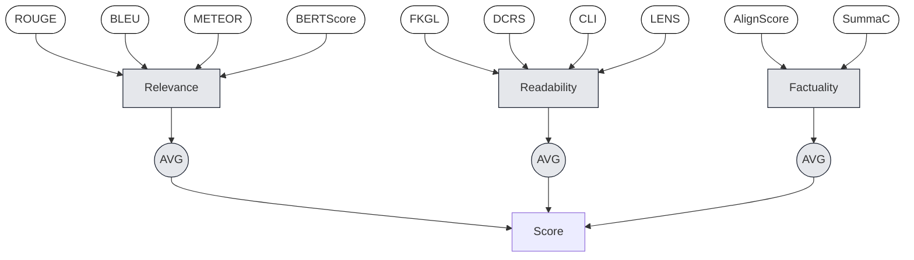
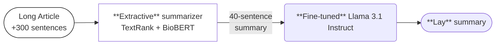
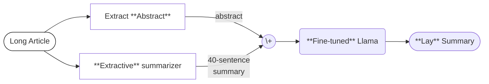
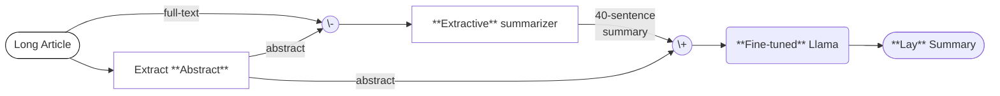

# Instruction-based Summarization with Contrastive Decoding

`SUWMIT` Priyam Basu, Jose Cols, Daniel Jarvis, Yongsin Park, Daniel Rodabaugh

---
layout: top-title
color: violet
---

:: title ::

# Introduction: `BioLaySumm 2025`

:: content ::

  - Biomedical publications contain the **latest** research on **health**-related topics.
  - **Technical language** makes it **difficult** for non-expert audiences to understand their contents.

<v-switch>
  <template #1>

> In temperate climates , winter deaths exceed summer ones . However , there is limited information on the timing and the relative magnitudes of maximum and minimum mortality , by local climate , age group , sex and medical cause of death . We used geo-coded mortality data and wavelets to analyse the seasonality of mortality by age group and sex from 1980 to 2016 in the USA and its subnational climatic regions .

<solar-arrow-down-bold-duotone class="text-4xl" />

> In the USA , more deaths happen in the winter than the summer . But when deaths occur varies greatly by sex , age , cause of death , and possibly region . Seasonal differences in death rates can change over time due to changes in factors that cause disease or affect treatment . Analyzing the seasonality of deaths can help scientists determine whether interventions to minimize deaths during a certain time of year are needed , or whether existing ones are effective .

  </template>
  <template #2> 

> In temperate climates , winter deaths exceed summer ones . However , there is limited information on the timing and the relative magnitudes of maximum and minimum mortality , by local climate , age group , sex and medical cause of death . We used geo-coded mortality data and wavelets to analyse the seasonality of mortality by age group and sex from 1980 to 2016 in the USA and its subnational climatic regions .

<solar-arrow-down-bold-duotone class="text-4xl" />

> In the USA , more deaths happen in the winter than the summer . But when deaths occur varies greatly by sex , age , cause of death , and possibly region . Seasonal differences in death rates can change over time due to changes in factors that cause disease or affect treatment . Analyzing the seasonality of deaths can help scientists determine whether interventions to minimize deaths during a certain time of year are needed , or whether existing ones are effective .

  </template>
  <template #3> 

> In temperate climates , winter deaths exceed summer ones . However , there is limited information on the timing and the relative magnitudes of maximum and minimum mortality , by local climate , age group , sex and medical cause of death . We used geo-coded mortality data and wavelets to analyse the seasonality of mortality by age group and sex from 1980 to 2016 in the USA and its subnational climatic regions .

<solar-arrow-down-bold-duotone class="text-4xl" />

> In the USA , more deaths happen in the winter than the summer . But when deaths occur varies greatly by sex , age , cause of death , and possibly region . Seasonal differences in death rates can change over time due to changes in factors that cause disease or affect treatment . Analyzing the seasonality of deaths can help scientists determine whether interventions to minimize deaths during a certain time of year are needed , or whether existing ones are effective . Now , Parks et al . show that there are age and sex differences in which times of year most deaths occur .

  </template>
</v-switch>

---
layout: top-title
color: violet
---

:: title ::

# Introduction: `Data`

:: content ::

- **2 datasets** (`PLOS` and `eLife`) with three splits: `train`, `validation`, and `test`.
- 30,735 biomedical articles with **expert-written** summaries *(English)*. 
- 284 articles (142 per dataset) include only the original text, with **no summaries**.

<v-click>

—

**Observations:**

1. *Readability* and summary length **vary** within each dataset.
2. These variations are significant when **comparing the two** datasets.

</v-click>

---
layout: full
---

Distribution of **summary lengths** across training and validation splits for the `PLOS` and `eLife` datasets

---
layout: top-title
color: violet
---

:: title ::

# Related Work

:: content ::

**You et al., 2024**

- TODO

---
layout: top-title
color: violet
---

:: title ::

# Evaluation

:: content ::

10 automated metrics grouped into **3 criteria**:

<v-clicks depth="1">

* **Relevance (4):** ROUGE, BLEU, METEOR, and BERTScore.
  * Measure **lexical overlap** and semantic similarity in embedding space.
* **Readability (4):** Flesch-Kincaid Grade Level, Dale-Chall Readability Score, CLI, and LENS.
  * Combine **surface features** (sentence length) with learned embeddings that correlate with human judgments.
* **Factuality (2):** AlignScore and SummaC.
  * Summary's span alignment with reference and entailment scores to flag contradictions or omissions.

</v-clicks>

---
layout: top-title
color: violet
---

:: title ::

# Evaluation

:: content ::

**Final Score =** Normalize scores by metric, average metrics for each criterion, and average across all criteria.

---
layout: top-title
color: violet
---

:: title ::

# Model: `Baseline`

:: content ::

"Extract-then-abstract" pipeline without preprocessing.

<v-clicks>

- **Extract** 40 sentences using `TextRank` and `BioBERT`. 
- Fine-tune Llama 3.1 Instruct using **extractive summaries** as input.

> **Instruction:** You are a specialist medical communicator responsible for translating biomedical articles into a clear, accurate 10–20 sentence summary for non-experts. The summary should be at a Flesch–Kincaid grade level of 10–14 and explain any technical terms.

</v-clicks>

<v-click>

—

- Comparable performance to You et al., 2024.
  - The `relevance` and `factuality` scores are **slightly worse**.

</v-click>

---
layout: top-title
color: violet
---

:: title ::

# Model: `Interim`

:: content ::

Focus first on improving `factuality` scores.

<v-clicks>

  - **Extractive summaries** alone achieved top scores in factual accuracy.
  - Focusing on 2 metrics is **simpler** than managing 4.
  - Potentially more **impactful** since `factuality` is averaged over 2 metrics rather than 4. 

</v-clicks>

<v-click>

—

**How?**

</v-click>

<v-click>

"Let's just submit the abstracts"

Strong performance in `factuality`: AlignScore of **0.9908** and a SummaC score of **0.9528**.

</v-click>

---
layout: top-title
color: violet
---

:: title ::

# Model: `Interim`

:: content ::

Explore 3 **fine-tuning** experiments that combine the article's **abstract** with other text as input.

<v-click>

- Abstract only:

</v-click>

<v-click>

- Abstract concatenated with extractive summary:

</v-click>

---
layout: top-title
color: violet
---

:: title ::

# Model: `Interim`

:: content ::

- Abstract concatenated with extractive summary that **excluded** the abstract during extraction.

<v-click>

—

All these experiments performed **worse** than our baseline.

</v-click>

---
layout: top-title
color: violet
---

:: title ::

# Model: `Final`

:: content ::

TODO

---
layout: full
---

Final **pipeline** for rapid experimentation in summarization

---
layout: top-title
color: violet
---

:: title ::

# Results

:: content ::

- TODO

---
layout: top-title
color: violet
---

:: title ::

# Discussion

:: content ::

- TODO

---
layout: center
---

# Questions?

Parts of this work was/were completed on Hyak, UW's high-performance computing cluster. This resource was funded by the Student Technology Fee.